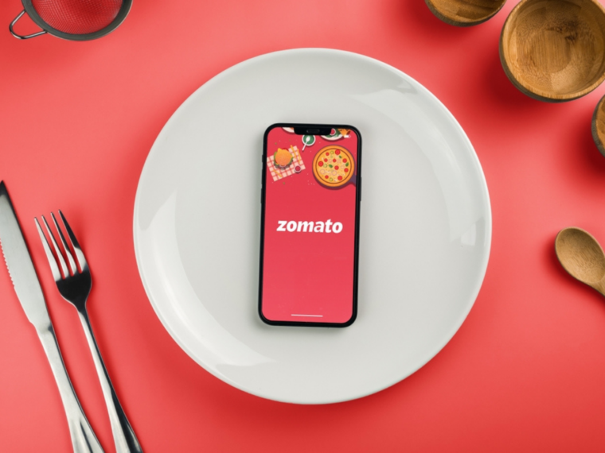
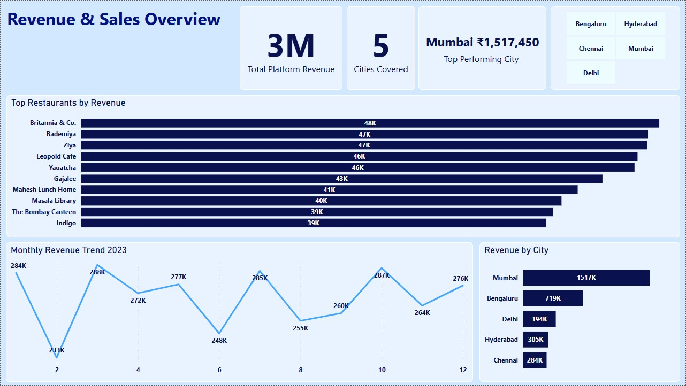
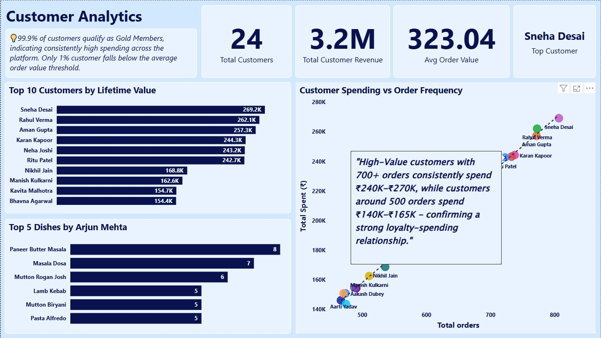
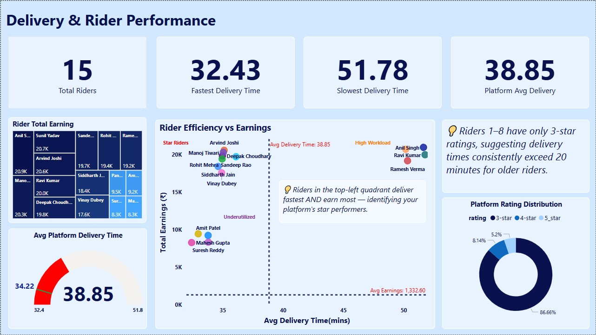
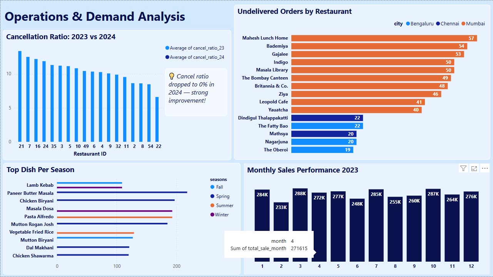

# SQL Data Analysis for The delivery Food Service Zomato

## Overview
This project is an end-to-end SQL analytics case study on a Zomato-style food delivery platform, built on five core tables: customers, restaurants, orders, deliveries, and riders. 
Using PostgreSQL, it explores customer behavior, restaurant performance, delivery efficiency, and seasonal demand patterns through 20 business-driven queries.

The analysis covers a wide range of questions: top dishes for a specific customer over the last 2.5 years, peak ordering time slots, high-value and high-frequency customers, and customers at risk of churn. 
It evaluates restaurant revenue by city, not-delivered orders and cancellation rates by year, most popular dishes per city, and city-level revenue rankings.

Operational performance is examined through rider-focused queries such as average delivery time, derived star ratings based on delivery speed, and monthly rider earnings (assuming an 8% commission on order value). 
Time-series and growth queries analyze monthly sales trends, restaurant growth ratios based on delivered orders, and seasonal demand spikes for menu items using a Spring/Summer/Fall/Winter breakdown.

Overall, the project demonstrates strong use of joins, window functions, CTEs, date/time logic, and conditional aggregation to answer realistic business questions for a food-delivery marketplace.

<p align="center">
  
</p>

## Project Structure

**Database Setup:-** Creating the database for zomato and then creating required tables and adding the relationship into these tables

```sql
-- CREATING TABLE

DROP TABLE IF EXISTS customers;

CREATE TABLE customers (
		customer_id INT PRIMARY KEY,
		customer_name VARCHAR(50),
		reg_date DATE
);

DROP TABLE IF EXISTS restaurants;

CREATE TABLE restaurants (
			restaurant_id INT PRIMARY KEY,
			restaurant_name VARCHAR(35),
			city VARCHAR(25),
			opening_hours VARCHAR(55)

);

DROP TABLE IF EXISTS orders;
CREATE TABLE orders (
					order_id INT PRIMARY KEY,
					customer_id INT,
					restaurant_id INT,
					order_item VARCHAR(55),
					order_date DATE,
					order_time TIME,
					order_status VARCHAR(30),
					total_amount FLOAT
);

DROP TABLE IF EXISTS riders;

CREATE TABLE riders (
				rider_id INT PRIMARY KEY,	
				rider_name VARCHAR(30),
				sign_up DATE
);

DROP TABLE IF EXISTS deliveries;

CREATE TABLE deliveries (
					delivery_id INT  PRIMARY KEY,
					order_id INT,
					delivery_status VARCHAR(50),
					delivery_time TIME,
					rider_id INT
);


-- CREATING FK RELATIONSHIP

ALTER TABLE deliveries
ADD CONSTRAINT fk_order_id
FOREIGN KEY (order_id)
REFERENCES orders(order_id);

ALTER TABLE deliveries
ADD CONSTRAINT fk_rider_id
FOREIGN KEY (rider_id)
REFERENCES riders(rider_id);

ALTER TABLE orders
ADD CONSTRAINT fk_customer_id
FOREIGN KEY (customer_id)
REFERENCES customers(customer_id);

ALTER TABLE orders
ADD CONSTRAINT fk_resturant_id
FOREIGN KEY (restaurant_id)
REFERENCES restaurants(restaurant_id);
```


**Data Import & Cleaning:-** Inserting the csv file data into the tables and then handling null values and ensuring data integrity.

**Business Problems and Key analyses:-** 

This project answers 20 business-focused questions that cover customers, restaurants, riders, and overall platform performance.
​
Customer and restaurant insights
- Top dishes for a specific customer: Identify the top 5 most frequently ordered dishes for a given customer (e.g., “Arjun Mehta”) over the last 2.5 years.​
- Peak ordering times: Find the 2‑hour time slots during which the platform receives the most orders.​
- High-frequency, high-value customers: Compute average order value (AOV) for customers who have placed more than 750 orders, and list customers who have spent more than 100K in total.​
- Undelivered orders by restaurant: Find orders that were placed but not delivered, aggregated by restaurant and city.​
- Restaurant revenue ranking: Rank restaurants by total revenue in the last 2.5 years, within each city​
- Most popular dish by city: Identify the most frequently ordered dish in each city.
- Inactive customers: Find customers who ordered in 2023 but did not place any order in 2024.

Cancellations and growth
- Yearly cancellation rates: Calculate and compare order cancellation rates for each restaurant between the current year and the previous year.
- Restaurant growth ratio: Compute each restaurant’s month‑over‑month growth in delivered orders using window functions.

Rider performance and earnings
- Average delivery time per rider: Calculate average delivery time for each rider, accounting for overnight deliveries.
- Monthly rider earnings: Estimate each rider’s total monthly earnings assuming an 8% commission on order amounts.
- Rider star ratings: Derive 5‑star, 4‑star, and 3‑star counts per rider based on delivery time thresholds (under 15 minutes, 15–20, over 20).
- Rider efficiency extremes: Identify riders with the lowest and highest average delivery times.

Time-series, demand, and segmentation
- Weekly peaks per restaurant: Find the peak day of the week for orders for each restaurant.
- Customer lifetime value: Compute total revenue generated by each customer across all their orders.
- Monthly sales trends: Compare each month’s total sales to the previous month to identify trends.
- Seasonal item demand: Track the popularity of dishes across seasons (Spring, Summer, Fall, Winter) and identify the top season for each item.
- City revenue ranking: Rank cities by total revenue for the year 2023.
- Customer segmentation: Segment customers into “Gold” and “Silver” based on their total spending relative to average order value, and summarize total orders and revenue per segment.

#### Q1 Write a query to find the top 5 most frequently ordered dishes by the customer "Arjun Mehta" in the last 2.5 year.

```sql
SELECT * 
FROM (SELECT 
	c.customer_id,
	c.customer_name,
	o.order_item AS dishes,
	COUNT(*) as total_orders,
	DENSE_RANK() OVER(ORDER BY COUNT(*) DESC) AS rank
FROM customers AS c
JOIN orders AS o
ON o.customer_id = c.customer_id
WHERE o.order_date >= (CURRENT_DATE - INTERVAL '2.5 Year') AND c.customer_name = 'Arjun Mehta'  
GROUP BY 1,2,3) as t1
WHERE rank BETWEEN 1 AND 5;
```
#### Q2 Identify the time slots during which the most orders are placed, based on 2-hour intervals.

This one I solved by two approach
```sql
-- Approach 1
-- create 2 hour slot

SELECT
		CASE
			WHEN  EXTRACT(HOUR FROM order_time) BETWEEN 0 AND 1 THEN '00:00 - 02:00'
			WHEN  EXTRACT(HOUR FROM order_time) BETWEEN 2 AND 3 THEN '02:00 - 04:00'
			WHEN  EXTRACT(HOUR FROM order_time) BETWEEN 4 AND 5 THEN '04:00 - 06:00'
			WHEN  EXTRACT(HOUR FROM order_time) BETWEEN 6 AND 7 THEN '06:00 - 08:00'
			WHEN  EXTRACT(HOUR FROM order_time) BETWEEN 8 AND 9 THEN '08:00 - 10:00'
			WHEN  EXTRACT(HOUR FROM order_time) BETWEEN 10 AND 11 THEN '10:00 - 12:00'
			WHEN  EXTRACT(HOUR FROM order_time) BETWEEN 12 AND 13 THEN '12:00 - 14:00'
			WHEN  EXTRACT(HOUR FROM order_time) BETWEEN 14 AND 15 THEN '14:00 - 16:00'
			WHEN  EXTRACT(HOUR FROM order_time) BETWEEN 16 AND 17 THEN '16:00 - 18:00'
			WHEN  EXTRACT(HOUR FROM order_time) BETWEEN 18 AND 19 THEN '18:00 - 20:00'
			WHEN  EXTRACT(HOUR FROM order_time) BETWEEN 20 AND 21 THEN '20:00 - 22:00'
			WHEN  EXTRACT(HOUR FROM order_time) BETWEEN 21 AND 22 THEN '22:00 - 00:00'
		END as start_slot,
		COUNT(order_id) as total_order
FROM orders
GROUP BY 1
ORDER BY 2 DESC;

-- Approach 2

SELECT CONCAT(start_time,'  :  ',end_time) AS time_slot,
		total_orders
FROM(
SELECT 
	FLOOR(EXTRACT(HOUR FROM order_time)/2)*2 AS start_time,
	FLOOR(EXTRACT(HOUR FROM order_time)/2)*2+2 AS end_time,
	COUNT(*) AS total_orders
FROM orders
GROUP BY 1,2
ORDER BY 3 DESC) as t1;
```

#### Q3 Find the average order value (AOV) per customer who has placed more than 750 orders. Return: customer_name, aov (average order value).

```sql
SELECT *
FROM(SELECT c.customer_name,
	COUNT(*) as total_orders,
	ROUND(AVG(o.total_amount::numeric),2) AS average_order_value
FROM customers AS c
JOIN orders AS o
ON o.customer_id = c.customer_id
GROUP BY 1
ORDER BY 2 DESC) AS t1
WHERE total_orders > 750;
```

#### Q4 List the customers who have spent more than 100K in total on food orders. Return: customer_name, customer_id.

```sql
SELECT c.customer_name,
		c.customer_id
FROM customers AS c
JOIN orders AS o
ON o.customer_id = c.customer_id
GROUP BY 1,2
HAVING SUM(o.total_amount)> 100000;
```

#### Q5 Write a query to find orders that were placed but not delivered. Return: restaurant_name, city, and the number of not delivered orders.

```sql
SELECT r.restaurant_name,
r.city,
COUNT( DISTINCT CASE 
					WHEN d.delivery_status IN ('Not Delivered', 'Order') 
					OR 
					o.order_status <> 'Completed' 
					OR 
					d.order_id IS NULL 
					THEN 
					o.order_id
				END) AS not_delivered
FROM orders AS o
LEFT JOIN restaurants AS r
	ON r.restaurant_id = o.restaurant_id
LEFT JOIN deliveries AS d
	ON d.order_id = o.order_id
GROUP BY 1,2;
```

#### Q6 Rank restaurants by their total revenue from the last 2.5 year. Return: restaurant_name, total_revenue, and their rank within their city.Q6 Rank restaurants by their total revenue from the last 2.5 year. Return: restaurant_name, total_revenue, and their rank within their city.

```sql
WITH ranking_table
AS
(
SELECT r.city,
		r.restaurant_name,
		SUM(o.total_amount) AS revenue,
		RANK() OVER(PARTITION BY r.city ORDER BY SUM(o.total_amount) DESC) AS rank
FROM orders AS o
JOIN restaurants AS r
ON r.restaurant_id = o.restaurant_id
WHERE o.order_date >= CURRENT_DATE - INTERVAL '2.5 year'
GROUP BY 1,2
)

SELECT *
FROM ranking_table;
```

#### Q7 Identify the most popular dish in each city based on the number of orders.

```sql
WITH dish_table
AS
(SELECT o.order_item,
		r.city,
		COUNT(o.order_item) as no_of_ordered_dish,
		RANK() OVER(PARTITION BY r.city ORDER BY COUNT(o.order_item) DESC) as rank
FROM orders AS o
JOIN restaurants AS r
ON r.restaurant_id = o.restaurant_id
GROUP BY 1,2
)

SELECT *
FROM dish_table
WHERE rank = 1;
```

#### Q8 Find customers who haven’t placed an order in 2024 but did in 2023. Need customer_name, customer id

```sql
SELECT DISTINCT c.customer_id, c.customer_name
FROM orders AS o
JOIN customers AS c
ON c.customer_id = o.customer_id
WHERE EXTRACT(YEAR FROM o.order_date) = 2023 AND c.customer_id NOT IN (
																SELECT DISTINCT customer_id
																FROM orders
																WHERE EXTRACT(YEAR FROM order_date) = 2024
																);
```

#### Q9 Calculate and compare the order cancellation rate for each restaurant between the current year and the previous year.

```sql
WITH cancel_ratio_23
AS
(
	SELECT o.restaurant_id,
		COUNT(o.order_id) AS total_orders,
		COUNT(
				CASE WHEN d.delivery_status IN ('Not Delivered', 'Order') 
					OR 
					o.order_status <> 'Completed' 
					OR 
					d.order_id IS NULL THEN 1 END
		) as not_delivered
	FROM orders AS o
	FULL OUTER JOIN deliveries AS d
	ON d.order_id = o.order_id
	WHERE EXTRACT(YEAR FROM o.order_date) = 2023
	GROUP BY 1
),
cancel_ratio_24
AS
(
	SELECT o.restaurant_id,
		COUNT(o.order_id) AS total_orders,
		COUNT(
				CASE WHEN d.delivery_status IN ('Not Delivered', 'Order') 
					OR 
					o.order_status <> 'Completed' 
					OR 
					d.order_id IS NULL THEN 1 END
		) as not_delivered
	FROM orders AS o
	FULL OUTER JOIN deliveries AS d
	ON d.order_id = o.order_id
	WHERE EXTRACT(YEAR FROM o.order_date) = 2024
	GROUP BY 1
),
last_year_data
AS
(
	SELECT restaurant_id,
		total_orders,
		not_delivered,
		ROUND(not_delivered::numeric/total_orders::numeric * 100,2) AS cancel_ratio_23
	FROM cancel_ratio_23
),
current_year_data
AS
(
	SELECT restaurant_id,
		total_orders,
		not_delivered,
		ROUND(not_delivered::numeric/total_orders::numeric * 100,2) AS cancel_ratio_24
	FROM cancel_ratio_24
)

SELECT
	cy.restaurant_id,
	ly.total_orders As total_orders_23,
	cy.total_orders AS total_orders_24,
	ly.not_delivered AS not_delivered_in_23,
	cy.not_delivered AS not_delivered_in_24,
ly.cancel_ratio_23,
	cy.cancel_ratio_24
FROM current_year_data as cy
JOIN last_year_data as ly
ON cy.restaurant_id=ly.restaurant_id;
```

#### Q10 Determine each rider's average delivery time.

```sql
SELECT 
	d.rider_id,
	r.rider_name,
	ROUND(AVG(EXTRACT(EPOCH FROM ((d.delivery_time - o.order_time) + 
			CASE WHEN d.delivery_time < o.order_time THEN INTERVAL '1 day'
			ELSE INTERVAL '0 day' END))/60.0),2)  as time_difference
FROM orders AS o
JOIN  deliveries AS d
ON d.order_id = o.order_id
JOIN riders as r
ON r.rider_id = d.rider_id
WHERE d.delivery_status = 'Delivered'
GROUP BY 1,2;
```

#### Q11 Calculate each restaurant's growth ratio based on the total number of delivered orders since its joining.

```sql
WITH growth_ratio
AS
(
SELECT 
	o.restaurant_id,
	DATE_TRUNC('month',o.order_date) as month,
	COUNT(o.order_id) as current_month_orders,
	LAG(COUNT(o.order_id),1) OVER(PARTITION BY o.restaurant_id ORDER BY DATE_TRUNC('month',o.order_date)) as last_month_orders 
FROM orders AS o
JOIN deliveries as d
ON d.order_id = o.order_id
WHERE d.delivery_status = 'Delivered'
GROUP BY 1,2
)
SELECT 
	restaurant_id,
	month,
	current_month_orders,
	last_month_orders,
	ROUND((current_month_orders::numeric - last_month_orders::numeric)/last_month_orders::numeric * 100,2) as each_rest_ratio
FROM growth_ratio;
```

#### Q12 Segment customers into 'Gold' or 'Silver' groups based on their total spending compared to the average order value (AOV). If a customer's total spending exceeds the AOV, label them as
'Gold'; otherwise, label them as 'Silver'. Return: The total number of orders and total revenue for each segment.

```sql
WITH segment
AS(SELECT 
	customer_id,
	SUM(total_amount) AS total_spend,
	COUNT(order_id) AS total_orders,
	CASE 
		WHEN SUM(total_amount)>(SELECT AVG(total_amount) FROM orders) THEN 'Gold Member'
		ELSE 'Silver Member'
	END AS customer_category
FROM orders
GROUP BY 1)

SELECT 
	SUM(total_spend) AS total_revenue,
	SUM(total_orders) AS total_orders,
	customer_category
FROM segment
GROUP BY 3
```

#### Q13 Calculate each rider's total monthly earnings, assuming they earn 8% of the order amount.

```sql
SELECT 
	d.rider_id,
	EXTRACT(MONTH FROM o.order_date) AS month,
	EXTRACT(YEAR FROM o.order_date) AS YEAR,
	COUNT(o.order_id) AS total_orders,
	ROUND(SUM(o.total_amount)::numeric * 0.08, 2) AS total_earning
FROM orders as o
JOIN deliveries as d
ON d.order_id = o.order_id
GROUP BY 1,2,3
ORDER BY 1,3,2
```

#### Q14 Find the number of 5-star, 4-star, and 3-star ratings each rider has.
Riders receive ratings based on delivery time:
● 5-star: Delivered in less than 15 minutes
● 4-star: Delivered between 15 and 20 minutes
● 3-star: Delivered after 20 minutes

```sql
SELECT 
	rider_id,
	rating,
	COUNT(*) AS total_stars
FROM
	(SELECT 
		rider_id,
		delivery_process_time,
		CASE WHEN delivery_process_time<15 THEN '5_star' 
			 WHEN delivery_process_time BETWEEN 15 AND 20 THEN '4-star'
			 ELSE '3-star'
		END AS rating
	FROM 
		(SELECT 
			d.rider_id,
			r.rider_name,
			EXTRACT(EPOCH FROM(d.delivery_time-o.order_time) + CASE WHEN d.delivery_time < o.order_time THEN INTERVAL '1 day'
					ELSE INTERVAL '0 day' END)/60 as delivery_process_time
		FROM orders AS o
		JOIN  deliveries AS d
		ON d.order_id = o.order_id
		JOIN riders as r
		ON r.rider_id = d.rider_id
		WHERE d.delivery_status = 'Delivered'
	)as t1) as t2
GROUP BY 1, 2
ORDER BY 1,3 DESC;
```

#### Q15 Analyze order frequency per day of the week and identify the peak day for each restaurant.

```sql
SELECT 
	*
FROM (
SELECT 
	r.restaurant_name,
	TO_CHAR(o.order_date, 'Day') as day,
	COUNT(o.order_id) as order_count,
	RANK() OVER(PARTITION BY r.restaurant_name ORDER BY COUNT(o.order_id) DESC) AS rank
FROM orders AS o
JOIN restaurants AS r
ON r.restaurant_id = o.restaurant_id
GROUP BY 1,2 
) AS t1
WHERE rank = 1;
```

#### Q16 Calculate the total revenue generated by each customer over all their orders.

```sql
SELECT 
	c.customer_name,
	o.customer_id,
	SUM(o.total_amount) AS customer_lifetime_value
FROM orders AS o
JOIN customers AS c
ON c.customer_id = o.customer_id
GROUP BY 1,2;
```

#### Q17 Identify sales trends by comparing each month's total sales to the previous month.

```sql
SELECT 
	year,
	month,
	total_sale_month,
	LAG(month,1) OVER(ORDER BY year, month), 
	LAG(total_sale_month,1) OVER(ORDER BY year, month) as previous_month_total_sale
FROM (
	SELECT 
		EXTRACT(YEAR FROM order_date) as year,
		EXTRACT(MONTH FROM order_date) as month,
		SUM(total_amount) as total_sale_month
	FROM orders
	GROUP BY 1,2) t1;
```

#### Q18 Evaluate rider efficiency by determining average delivery times and identifying those with the lowest and highest averages.

```sql
SELECT
	MAX(avg_time) AS highest_avg_time,
	MIN(avg_time) AS lowest_avg_time
FROM
(
	WITH avg_delivery_time
	AS 
		(SELECT 
			d.rider_id,
			r.rider_name,
			ROUND(AVG(EXTRACT(EPOCH FROM ((d.delivery_time - o.order_time) + 
					CASE WHEN d.delivery_time < o.order_time THEN INTERVAL '1 day'
					ELSE INTERVAL '0 day' END))/60.0),2)  as time_difference
		FROM orders AS o
		JOIN  deliveries AS d
		ON d.order_id = o.order_id
		JOIN riders as r
		ON r.rider_id = d.rider_id
		WHERE d.delivery_status = 'Delivered'
		GROUP BY 1,2)
		
	SELECT 
		rider_id,
		rider_name,
		AVG(time_difference) AS avg_time
	FROM avg_delivery_time
	GROUP BY 1,2) as t1;
```

#### Q19 Track the popularity of specific order items over time and identify seasonal demand spikes.

```sql
SELECT *
FROM (SELECT 
	order_item,
	seasons,
	COUNT(order_id) as total_orders,
	RANK() OVER(PARTITION BY order_item ORDER BY COUNT(order_id) DESC) AS rank
FROM (
	SELECT
		order_item,
		order_id,
		EXTRACT(MONTH FROM order_date),
		CASE 
			WHEN EXTRACT(MONTH FROM order_date) BETWEEN 3 AND 5 THEN ' Spring'
			WHEN EXTRACT(MONTH FROM order_date) BETWEEN 6 AND 8 THEN ' Summer'
			WHEN EXTRACT(MONTH FROM order_date) BETWEEN 9 AND 11 THEN ' Fall'
			ELSE 'Winter'
		END as seasons
	FROM orders
		) as t1
GROUP BY 1,2) AS t2
WHERE rank = 1
```

#### Q20 Rank each city based on the total revenue for the last year (2023).

```sql
WITH year_table
AS 
(
	SELECT 
		*,
		EXTRACT(YEAR FROM o.order_date) as year
	FROM orders as o
	JOIN restaurants as r
	ON o.restaurant_id = r.restaurant_id
)

SELECT 	
	city,
	SUM(total_amount) as total_revenue,
	RANK() OVER(ORDER BY SUM(total_amount) DESC) as city_rank
FROM year_table
WHERE year = 2023
GROUP BY 1;
```

**Key findings:-** 

#### Customer behavior
- A small group of heavy users contributes a large share of total revenue, with some customers placing hundreds of orders and reaching very high lifetime value.
- Many customers show strong activity in their first months and then slow down, and you can clearly identify customers who ordered in 2023 but became inactive in 2024.

#### Restaurant performance
- Revenue is highly concentrated in a few top restaurants in each city, while many others generate modest sales despite similar opening hours.
- Certain restaurants suffer noticeably higher shares of undelivered or canceled orders, indicating operational or quality issues that directly impact lost revenue.

#### Demand patterns
- Orders peak in specific 2‑hour evening slots, confirming that demand is strongly time‑of‑day driven and should inform staffing and rider allocation.
- Some dishes (for example biryanis, pizzas, and a few signature items) dominate both order volume and revenue, and several of them show clear seasonal spikes.
- City‑level analysis shows a clear revenue hierarchy among cities, with a few markets driving most of the platform’s 2023 revenue.

#### Delivery and riders
- Average delivery times are generally within target windows, but a subset of riders consistently deliver faster than others, while a few lag behind the platform average.
- Delivery failures cluster around specific time windows and restaurant–rider combinations, suggesting targeted process improvements could reduce cancellations.
- Based on an 8% commission assumption, top riders earn significantly more in busy months and cities, reflecting both higher order density and their efficiency.

#### Segmentation and growth
- “Gold” customers drive the majority of orders and revenue, confirming the importance of retention and loyalty programs for this segment.
- Monthly sales trends show clear growth phases and slower periods, and restaurant‑level growth ratios highlight which partners are scaling fastest after joining the platform.

**Power Bi Dashboard:-**

#### Page 1:- Revenue & Sales Overview
- Provides a high-level snapshot of platform-wide financial performance.
- **Total Platform Revenue:** ₹3M+ across 5 cities.
- **Top Performing City:** Mumbai at ₹1,517,450.
- Visuals: KPI cards, Top 10 Restaurants bar chart, Monthly Revenue Trend (2023), Revenue by City breakdown.
- City slicer allows filtering all visuals dynamically.

<p align="center">
  
</p>

#### Page 2:- Customer Analytics
- Deep dives into customer behavior, loyalty, and lifetime value.
- **Total Customers:** 24 | **Avg Order Value:** ₹323.04.
- **Top Customer:** Sneha Desai with ₹269.2K lifetime value.
- Visuals: Top 10 Customers bar chart, Customer Spending vs Order Frequency scatter plot, Top 5 dishes by customer.
- Key insight: Customers with 700+ orders consistently spend ₹240K–₹270K, confirming strong loyalty-spending relationship.

<p align="center">
  
</p>

#### Page 3:- Delivery & Rider Performance
- Evaluates individual rider efficiency, earnings, and customer ratings.
- **Total Riders:** 15 | **Fastest:** 32.43 mins | **Slowest:** 51.78 mins.
- **Platform Avg Delivery:** 38.85 mins vs 34.22 target.
- Visuals: Gauge (delivery time vs target), Rider Efficiency vs Earnings scatter with quadrant lines, Platform Rating Distribution donut chart.
- Key insight: Key insight: Star riders (top-left quadrant) deliver fastest AND earn most — identifying top performers.

<p align="center">
  
</p>

#### Page 4:- Operations & Demand Analysis
- Uncovers operational bottlenecks and seasonal demand patterns.
- **Cancellation ratio dropped to 0%** in 2024 — major improvement.
- **Mahesh Lunch Home, Mumbai** has highest undelivered orders (57).
- Visuals: Cancellation Ratio 2023 vs 2024 clustered bar, Undelivered Orders by Restaurant, Top Dish Per Season, Monthly Sales Performance 2023.
- Key insight: Spring dominates demand with Paneer Butter Masala leading at 218 orders.

<p align="center">
  
</p>

**Key Business Insights:-**
Key Business Insights

|   | Insight |
|---|---------|
| 1 | Mumbai contributes ~47% of total platform revenue |
| 2 | Platform avg delivery time (38.85 mins) exceeds target (34.22 mins) |
| 3 | 86.66% of deliveries are rated 3-star — quality improvement needed |
| 4 | Cancellation ratio improved from ~10% in 2023 to 0% in 2024 |
| 5 | High-value customers (700+ orders) spend 60% more than average |
| 6 | Spring is the peak demand season — Paneer Butter Masala tops orders |

**Conclusion:-** 
This project shows that a Zomato‑style platform can extract rich insights from its core transactional tables using SQL alone: who the most valuable customers are, which restaurants and cities drive growth, when and what people order, and how well the delivery network performs. Your queries combine joins, CTEs, window functions, and time‑series logic to answer realistic business questions, making this a strong portfolio piece that demonstrates both data modeling and analytical thinking.


